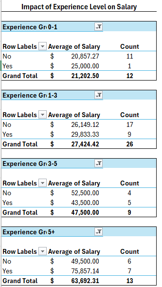
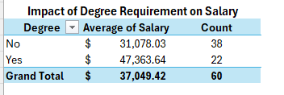
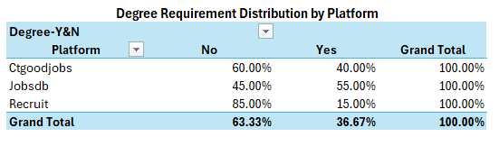
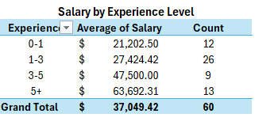
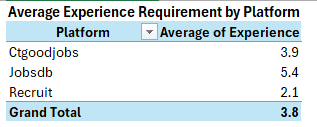
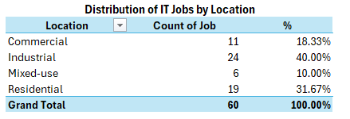
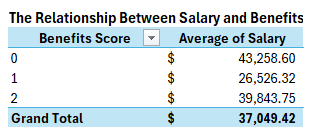

# IT Job Market Analysis in Hong Kong

## 🔥 Project Highlights

- Real-world dataset manually collected from 3 job platforms  
- Applied data cleaning and feature engineering (experience grouping, benefit scoring, location classification)  
- Conducted multi-dimensional analysis (salary, experience, education, platform, location, benefits)  
- Performed controlled analysis (Experience vs Degree) to avoid misleading conclusions  
- Generated actionable insights for IT job seekers in Hong Kong  

---

## Project Background

This project analyzes IT job market trends in Hong Kong based on manually collected job posting data from three recruitment platforms.

Unlike typical practice datasets, this project uses real-world job listings and transforms unstructured job descriptions into structured data for analysis.

---

## Objectives

- Compare salary levels across different platforms  
- Analyze the impact of experience on salary  
- Evaluate the role of education (degree)  
- Compare job requirements across platforms  
- Understand geographic distribution of IT jobs  
- Explore the relationship between salary and benefits  

---

## Data Source

Data was manually collected from:
- JobsDB  
- CTgoodjobs  
- Recruit  

Total: **60 job postings (20 per platform)**  

---

## Methodology

### Data Cleaning
- Converted salary into comparable average monthly values  
- Standardized experience into numeric format  
- Normalized degree requirement into Yes / No  

### Feature Engineering
- Grouped experience into:
  - 0–1 years  
  - 1–3 years  
  - 3–5 years  
  - 5+ years  

- Created a **Benefit Score** by counting listed benefits  
- Classified locations into:
  - Commercial  
  - Industrial  
  - Residential  
  - Mixed-use  

👉 *Insight:*  
Real-world job data is often inconsistent. Transforming raw text into structured variables is a key step in practical data analysis.

---

## Key Findings

### 1. Salary by Platform
JobsDB records the highest average salary, while Recruit has the lowest.

👉 *Insight:*  
This suggests that JobsDB may focus more on mid- to senior-level roles, while Recruit contains more entry-level opportunities.

👉 **Summary:** Salary varies significantly across platforms.

---

### 2. Experience vs Salary
Salary increases significantly with experience. A major jump occurs between 1–3 years and 3–5 years.

👉 *Insight:*  
This stage likely represents the transition from junior to mid-level roles.

👉 **Summary:** Salary growth is strongly driven by experience.

---

### 3. Degree vs Salary
Degree holders generally earn higher salaries, but many roles do not require a degree.

👉 *Insight:*  
A degree provides an advantage but is not a strict requirement.

👉 **Summary:** Degree helps, but is not essential.

---

### 4. Combined Analysis (Experience + Degree)
After controlling for experience, the impact of degree becomes less consistent.

👉 *Insight:*  
Experience has a stronger effect on salary than education.

👉 **Summary:** Experience is more important than degree.

---

### 5. Platform Requirements
- JobsDB: highest experience and degree requirements  
- CTgoodjobs: moderate  
- Recruit: lowest

👉 *Insight:*  
Each platform targets different job levels.

👉 **Summary:** Platform choice affects job accessibility.

---

### 6. Location Distribution
IT jobs are widely distributed across locations, with industrial areas having the highest share.

👉 *Insight:*  
This challenges the assumption that IT jobs are concentrated in business districts.

👉 **Summary:** IT jobs are geographically diverse.

---

### 7. Salary vs Benefits
The relationship between salary and benefits is not strictly linear.

👉 *Insight:*  
Some high-paying roles list fewer benefits, possibly due to incomplete job descriptions or senior-level positions.

👉 **Summary:** No clear trade-off between salary and benefits.

---

## 🧠 Analytical Thinking

This project goes beyond basic aggregation by applying controlled analysis.

For example:
- Instead of directly concluding that degree affects salary,  
- Experience was controlled to reveal the true relationship  

👉 This avoids misleading conclusions and reflects real-world analytical thinking.

---

## Conclusion

Experience is the most significant factor affecting salary in the IT job market.  
Education provides an advantage but is not a strict requirement.  

The IT job market includes both entry-level and high-requirement roles across different platforms and locations.

👉 **Final Insight:**  
For career switchers, focusing on gaining practical experience is more impactful than relying solely on formal education.

---

## Limitations

- Small sample size (60 job postings)  
- Manual data collection may introduce bias  
- Some job descriptions may be incomplete  

---

## Future Improvements

- Increase sample size  
- Include more platforms  
- Apply advanced analysis (e.g., regression models)
