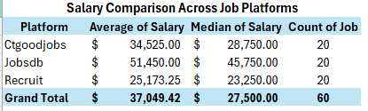

 1. Project Background
This project analyzes IT job market trends in Hong Kong based on manually collected job posting data from multiple platforms.

⸻

2. Objectives
* Compare salary across platforms
* Analyze the impact of experience and education
* Understand job requirements by platform
* Examine geographic distribution of IT jobs
* Explore the relationship between salary and benefits

⸻

3. Data Source
Data was manually collected from three job platforms (JobsDB, CTgoodjobs, Recruit), with 20 job postings from each platform.

⸻

4. Key Findings

💰 Salary by Platform

👉 JobsDB highest, Recruit lowest

⸻

📈 Experience vs Salary

👉 Strong positive relationship
👉 3–5 years = major jump

⸻

🎓 Degree vs Salary

👉 Degree helps, but not required

⸻

🧠 Combined Analysis

👉 Experience > Degree

⸻

🏢 Platform Requirements

👉 JobsDB = high requirement
👉 Recruit = entry level

⸻

📍 Location Distribution

👉 Industrial area highest

⸻

🎁 Salary vs Benefits

👉 No clear linear relationship
👉 Possible data limitation

⸻

📌 5. Conclusion（🔥加分位）

👉

Experience is the most significant factor affecting salary in the IT job market.
Education plays a role but is not a strict requirement.
Job opportunities are widely distributed across different locations and platforms.
